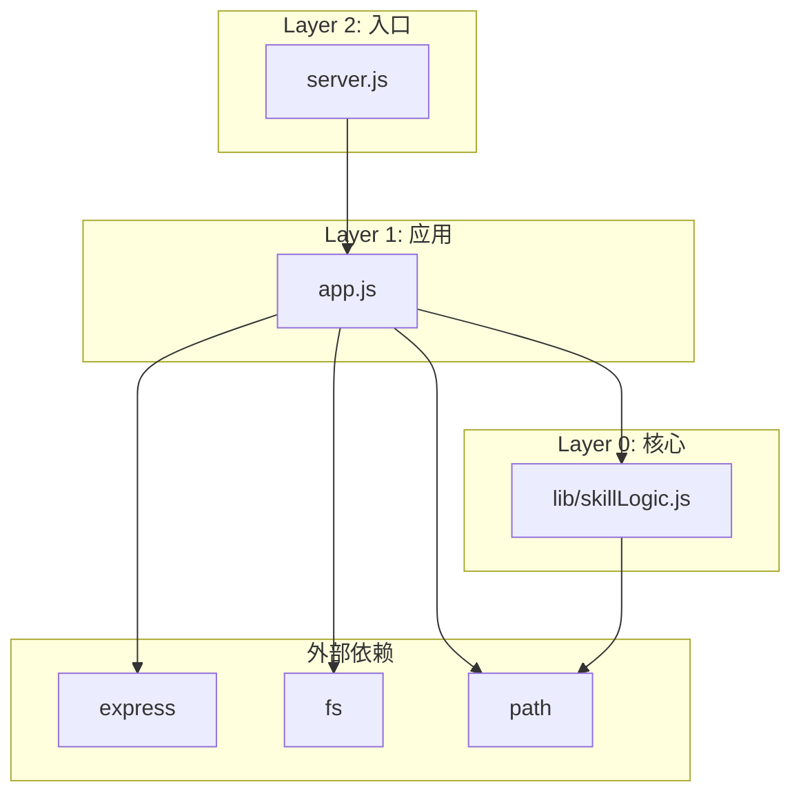

# ARCHITECTURE.md — Skill Manager 架构文档

> 本文档描述项目的技术架构、依赖关系和设计决策。所有声明均引用具体代码位置。

## 1. 架构概览

Skill Manager 是一个 Express API 服务器，用于管理 AI coding tool skills 的符号链接。

**核心理念**：三层架构，从外向内依赖。

```
┌─────────────────────────────────────────────────────────────┐
│  Layer 2: Entry Points (server.js)                          │
│  - 启动服务器，监听端口                                       │
│  - 导入: app.js                                             │
└─────────────────────────────────────────────────────────────┘
                            ↓ 导入
┌─────────────────────────────────────────────────────────────┐
│  Layer 1: Application (app.js)                              │
│  - API 路由定义                                              │
│  - 配置加载与持久化                                          │
│  - 文件系统操作                                              │
│  - 导入: skillLogic.js, express, fs, path, child_process   │
└─────────────────────────────────────────────────────────────┐
                            ↓ 导入
┌─────────────────────────────────────────────────────────────┐
│  Layer 0: Core Logic (lib/skillLogic.js)                    │
│  - 纯逻辑函数，无 I/O                                         │
│  - 导入: path (仅 Node 内置模块)                             │
└─────────────────────────────────────────────────────────────┘
```

### 依赖图



## 2. 层级定义

| 层级 | 文件 | 允许的导入 | 禁止的导入 |
|------|------|-----------|-----------|
| 0 | `lib/skillLogic.js` | `path`（Node 内置） | 任何内部模块、fs、express |
| 1 | `app.js` | skillLogic.js、express、fs、path、child_process | server.js |
| 2 | `server.js` | app.js | 直接导入 skillLogic.js |

**验证方法**：`npm run lint-arch` 检查违反规则的导入。

## 3. 核心逻辑详解

### 3.1 `isAllowed` — 规则优先级判断

位置：`lib/skillLogic.js:19-45`

三级优先级（最高优先）：

1. **Tool 级规则** (`toolRules[tool].blockAll`) — 禁止所有链接，仅允许白名单
2. **Group 级规则** (`groupRules[group].only/.exclude`) — 组级限制
3. **Skill 级规则** (`rules[skillName].only/.exclude`) — 单个 skill 限制

```javascript
// 示例：skill "brainstorming" 限制仅可用于 "claude"
rules: {
  "brainstorming": { only: ["claude"] }
}

// 示例：group "gstack" 禁止用于 "codex"
groupRules: {
  "gstack": { exclude: ["codex"] }
}

// 示例：tool "cursor" 禁止所有链接
toolRules: {
  "cursor": { blockAll: true }
}
```

### 3.2 `getSkillGroup` — 确定组名

位置：`lib/skillLogic.js:54-65`

逻辑：
1. 查找 skill 目录所属的 skillsDir
2. 如果 skillsDir 有显式 group 配置，使用该配置
3. 否则，取相对路径的第一段作为组名

```javascript
// skillsDir: ~/github, skillDir: ~/github/superpowers/brainstorming
// 结果: group = "superpowers"
```

### 3.3 `findSkillDirs` — 遍历查找

位置：`lib/skillLogic.js:79-108`

逻辑：
- 递归遍历 skillsDirs（最大深度 5）
- 找到包含 `SKILL.md` 的目录即为 skill
- 过滤 `DELETED_SKILLS` 和 `EXCLUDE_PROJECTS`
- 跳过顶级 `.git`、`.husky` 等目录（但允许顶级隐藏目录内的 skill）

## 4. API 端点详解

所有端点定义于 `app.js:257-703`。

### 4.1 Skills 列表

**GET `/api/skills`** — `app.js:257-277`

返回：
```json
{
  "skills": [
    {
      "name": "brainstorming",
      "path": "~/github/superpowers/brainstorming",
      "description": "Generate ideas...",
      "group": "superpowers",
      "standalone": false,
      "status": {
        "claude": "linked",
        "cursor": "missing"
      }
    }
  ],
  "tools": ["claude", "cursor", "codex"],
  "rules": {},
  "groupRules": {},
  "toolRules": {},
  "nameConflicts": {}
}
```

状态值：
- `linked` — 正确指向 skill 目录
- `missing` — 不存在
- `blocked` — 规则禁止
- `manual` — 用户手动断开（追踪）
- `wrong` — 指向错误路径
- `directory` — 存在但非符号链接

### 4.2 链接操作

**POST `/api/skills/:name/link`** — `app.js:321-350`

创建符号链接 `{toolDir}/{name}` → `{skillDir}`。

**DELETE `/api/skills/:name/link`** — `app.js:352-368`

删除符号链接，并记录到 `manualUnlinks`（防止 sync 自动恢复）。

### 4.3 批量操作

**POST `/api/sync`** — `app.js:559-627`

批量同步所有 skills 到所有 tools：
- 创建缺失的链接
- 跳过已存在的链接
- 跳过被规则禁止的
- 跳过手动断开的
- 检测名称冲突

**POST `/api/clean`** — `app.js:629-657`

清理失效的符号链接（目标目录已不存在）。

### 4.4 规则管理

**PUT `/api/skills/:name/rule`** — `app.js:395-443`

设置 skill 级规则。自动优化表示（选择 exclude 或 only 中更短的）。

**PUT `/api/groups/:group/rule`** — `app.js:445-493`

设置 group 级规则，同时清理该组所有已存在的违规链接。

**PUT `/api/tools/:tool/rule`** — `app.js:495-524`

设置 tool 级 blockAll 规则，清理该 tool 所有符号链接。

**PUT `/api/tools/:tool/allow`** — `app.js:526-557`

在 blockAll 模式下，添加 skill 或 group 到白名单。

### 4.5 删除操作

**DELETE `/api/skills/:name`** — `app.js:370-376`

软删除（添加到 deletedSkills）或硬删除（rm -rf）。

**DELETE `/api/groups/:group`** — `app.js:378-393`

批量删除组内所有 skills。

**POST `/api/skills/:name/restore`** — `app.js:312-319`

从 deletedSkills 恢复。

## 5. 配置系统

配置文件 `tools.json` 结构：

```json
{
  "skillsDir": "~/github",
  "tools": {
    "claude": "~/.claude/skills",
    "cursor": "~/.cursor/skills"
  },
  "excludeProjects": ["node_modules"],
  "rules": {},
  "groupRules": {},
  "toolRules": {},
  "deletedSkills": [],
  "manualUnlinks": {}
}
```

### 环境变量覆盖

| 环境变量 | 覆盖字段 |
|---------|---------|
| `SKILLS_DIR` | `skillsDir`（逗号分隔） |
| `{TOOL}_SKILLS` | `tools[TOOL]` |
| `EXCLUDE_PROJECTS` | `excludeProjects`（逗号分隔） |
| `PORT` | 服务器端口 |

### 配置热重载

`app.js:79-87` — 使用 `fs.watch` 监视配置文件，300ms 防抖后自动重载。

## 6. 持久化

所有规则变更直接写入 `tools.json`：

- `saveRules` — `app.js:91-96`
- `saveGroupRules` — `app.js:98-103`
- `saveToolRules` — `app.js:105-110`
- `saveDeletedSkills` — `app.js:112-117`
- `saveManualUnlinks` — `app.js:119-127`

写入格式：`JSON.stringify(raw, null, 2) + '\n'`（保持可读性）。

## 7. 前端

`public/index.html` — 单页面 UI，使用原生 JavaScript。

功能：
- 列表展示所有 skills（按 group 分组）
- 点击链接/断开操作
- 规则管理面板
- 批量同步/清理按钮

## 8. 测试策略

测试覆盖核心逻辑和 API：

| 测试文件 | 覆盖范围 |
|---------|---------|
| `isAllowed.test.js` | `lib/skillLogic.js:19-45` |
| `getSkillGroup.test.js` | `lib/skillLogic.js:54-65` |
| `findSkillDirs.test.js` | `lib/skillLogic.js:79-108` |
| `api.sync.test.js` | `app.js:559-627` |
| `api.clean.test.js` | `app.js:629-657` |
| `api.delete.test.js` | `app.js:370-393` |
| `api.manual-unlink.test.js` | manualUnlinks 追踪逻辑 |

测试框架：Jest，覆盖率阈值 80%。

Mock 方法：`scripts/create-mock.js` 创建 mock fs，注入到 app.js。

## 9. 错误处理

API 错误响应格式：

```json
{ "error": "错误信息" }
```

常见错误：
- 404：skill 不存在
- 400：参数无效
- 403：规则禁止
- 409：冲突（非符号链接、名称冲突）
- 500：内部错误

## 10. 安全考虑

- 配置文件路径使用 `expandHome` 处理 `~` (`app.js:20-22`)
- 符号链接仅指向 skillsDirs 内的目录
- 环境变量覆盖优先于配置文件
- 测试可通过 `_TEST_CONFIG_PATH` 使用隔离配置